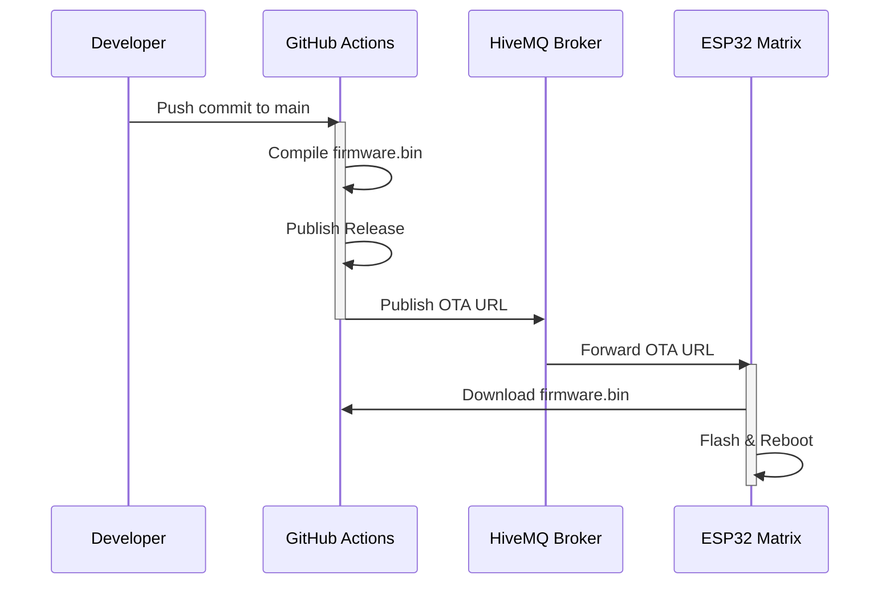

An embedded systems project implementing a robust Wi-Fi connected 16x16 WS2812B LED matrix. The firmware is built on the ESP32 platform using PlatformIO, leveraging MQTT for real-time remote control and Secure Over-The-Air (OTA) capabilities for remote management.

## System Architecture

This project was designed with a focus on separating the networking logic from the rendering pipeline, ensuring smooth animations while maintaining constant communication with cloud services. 

### Key Features
* **MQTT Telemetry & Control:** Utilizes a Publish/Subscribe model to switch animations, adjust brightness, display custom text strings, and acknowledge commands in real-time.
* **Over-The-Air (OTA) Updates:** Implements secure HTTP-based OTA firmware updates, allowing remote deployments across untrusted networks.
* **Live Frame Streaming:** Supports raw byte-array injections over MQTT to stream live pixel data directly to the matrix buffer.
* **Resilient Networking:** Implements automatic reconnection routines for Wi-Fi (`WiFiMulti`) and the MQTT broker to recover gracefully from network outages.

## Hardware Specifications
* **Microcontroller:** ESP32 Development Board (ESP-WROOM-32)
* **Display:** 16x16 WS2812B RGB LED Matrix
* **Logic Level:** 3.3V Logic (ESP32) to 5V (WS2812B) Data Pin (GPIO 13)

## Software Stack
* **Environment:** PlatformIO / C++
* **Core Framework:** Arduino framework for ESP32
* **Graphics & LED Drivers:** `FastLED` for low-level signal timing, `Adafruit_GFX` and `FastLED_NeoMatrix` for 2D geometry and font rendering.
* **Networking:** `WiFiMulti`, `PubSubClient` (MQTT), `HTTPUpdate`

## MQTT API Specification

The device listens to a predefined set of topics on the HiveMQ broker (`broker.hivemq.com`).

| Topic | Payload Format | Description |
|---|---|---|
| `.../anim` | Integer (String) | Switches the current animation state (0-5). |
| `.../message` | String | Overrides the display to scroll a custom text message. |
| `.../brightness` | Integer (0-255) | Dynamically adjusts the FastLED global brightness. |
| `.../live` | Byte Array (4 or 768) | Sends a single RGB pixel [Index, R, G, B] or a full 256-pixel RGB frame buffer. |
| `.../ota` | URL (String) | Triggers the ESP32 to download and install new firmware from the provided URL. |
| `.../ack` | String (Outbound) | The ESP32 publishes acknowledgments here upon receiving commands. |

## Build and Deployment Instructions

### Prerequisites
1. Install [PlatformIO IDE](https://platformio.org/) via VSCode.
2. Clone this repository.

### Configuration
MQTT broker topics are defined as constants at the top of `src/main.cpp` and should be updated to match your environment. Update the Wi-Fi credentials and Root CA certificate directly in the source code before compiling.

### Compiling and Uploading Firmware (Manual USB)
Build the firmware and upload it via USB:
```bash
pio run --target upload
```

### CI/CD Pipeline & Automated OTA Deployment
This project features a fully automated Continuous Integration and Continuous Deployment (CI/CD) pipeline powered by **GitHub Actions**. 

Whenever changes to the source code (`src/main.cpp`) are pushed to the `main` branch:
1. **Cloud Build:** The workflow automatically sets up PlatformIO and compiles the firmware in the cloud. PlatformIO dependencies are cached to ensure fast build times.
2. **Release Generation:** The compiled `firmware.bin` is automatically published as a GitHub Release tagged as `latest`.
3. **Automated Trigger:** The pipeline runs a Mosquitto client to publish the URL of the new firmware to the ESP32's `.../ota` MQTT topic.
4. **OTA Update:** The ESP32 receives the MQTT message, securely downloads the new binary directly from GitHub, and flashes itself over Wi-Fi without any physical intervention.



## Design Decisions and Trade-offs
* **Synchronous vs Asynchronous Networking:** The current implementation uses synchronous MQTT and Wi-Fi handling. While simpler to implement, it can introduce blocking behavior during network drops. Future iterations will migrate to `AsyncMqttClient` to ensure the display render loop maintains 60 FPS regardless of network latency.

## Future Development (TODO)
As I am working remotely from the ESP32, I'll need to make steady preperation to smoothly execute a fail proof OTA update for critical performance and security features. 
* **SPIFFS Asset Storage:** Migrate animation frames and binary assets from C++ arrays (`PROGMEM`) into the ESP32's onboard flash memory (SPIFFS). This will decouple media assets from the application logic, minimize SRAM consumption, speed up C++ compile times, and allow independent asset updates without recompiling or flashing the core executable.
* **Credential Security (`secrets.h`):** Decouple Wi-Fi credentials and OTA certificates from the main source code. The goal is to move sensitive network parameters (like `SECRET_WIFI_SSID` and `rootCACertificate`) into a dedicated `include/secrets.h` file excluded from version control via `.gitignore` to prevent accidental exposure. 